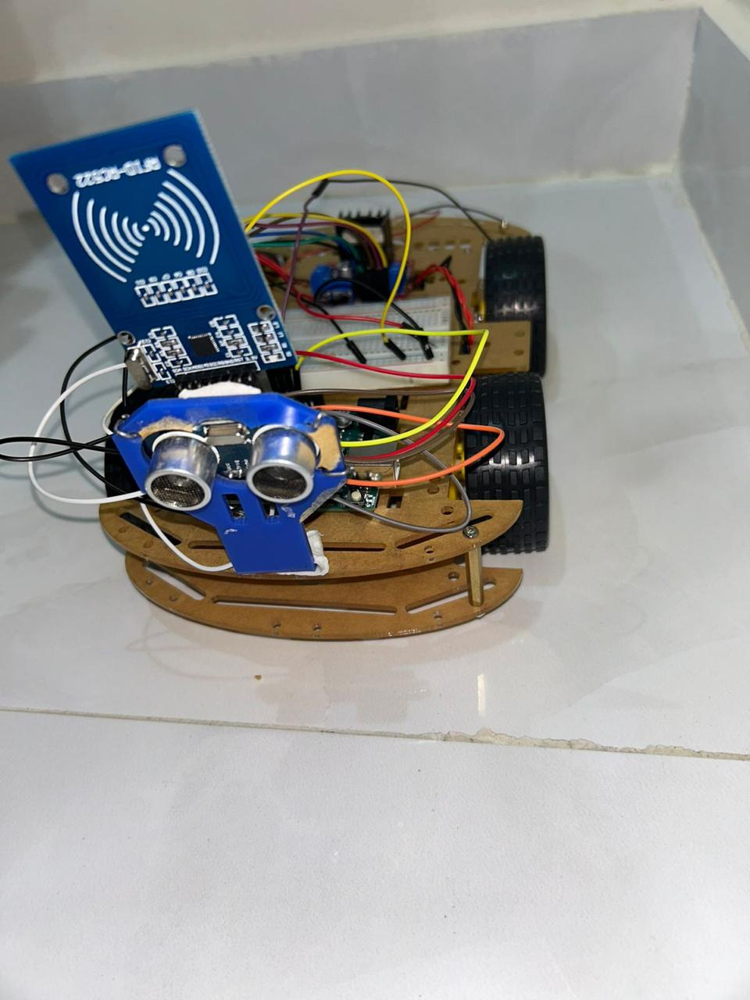
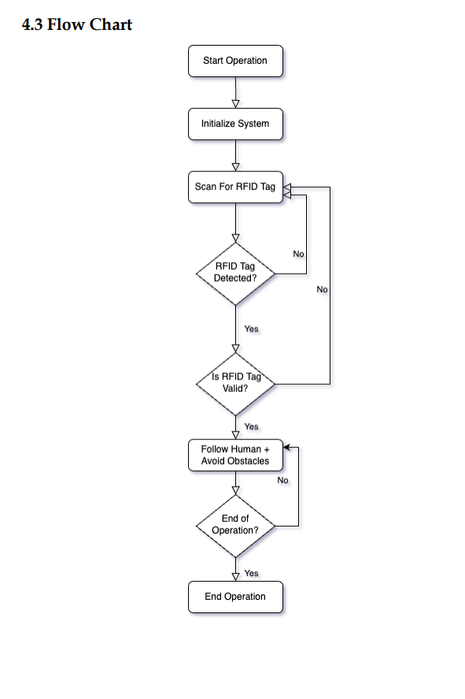
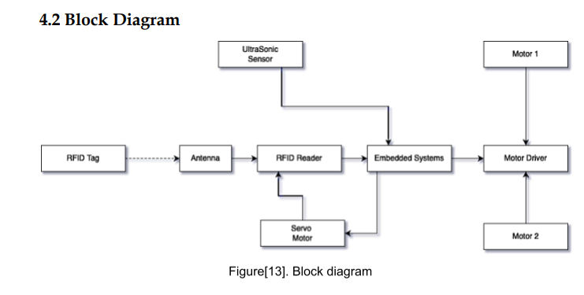
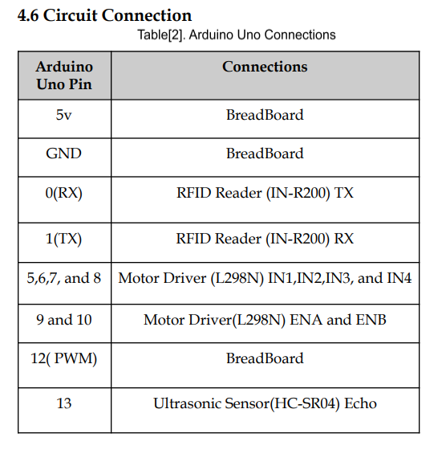
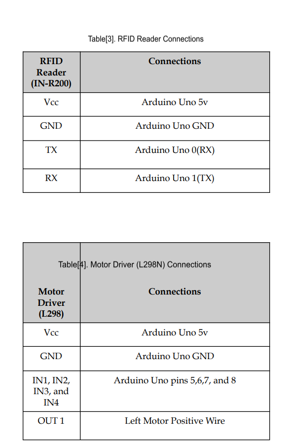
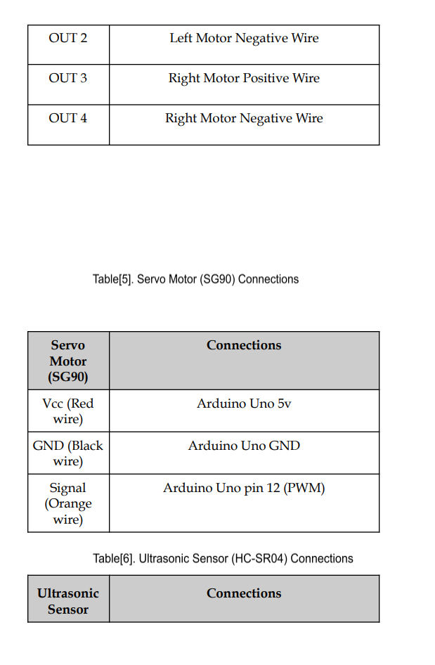
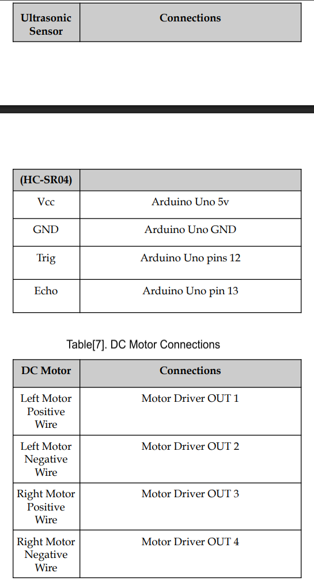

# 🤖 Follow Me Robot

An RFID-based autonomous robot that follows a designated person while avoiding obstacles using ultrasonic sensing.

---

## 📷 Project Preview

---

# 📖 Overview

The Follow Me Robot is a graduation project developed for the Bachelor's degree in Computer Engineering and Networks.

The robot uses RFID technology to identify and follow a specific person carrying an authorized RFID tag. It continuously monitors its surroundings using an ultrasonic sensor to detect obstacles and stop when necessary, ensuring safe autonomous navigation.

---

# ✨ Features

- RFID-based human identification
- Autonomous human following
- Obstacle detection
- Automatic stop for safety
- Arduino-based embedded system
- Low-cost hardware implementation

---

# 🛠 Hardware Components

- Arduino Uno R3
- RC522 RFID Reader
- RFID Tag
- HC-SR04 Ultrasonic Sensor
- L298N Motor Driver
- DC Motors
- Robot Chassis
- Battery Pack

---

# 💻 Software

- Arduino IDE
- C++
- SPI Library
- MFRC522 Library

---

# 🔄 System Workflow

The robot continuously checks for an RFID tag.

- If the correct tag is detected:
  - Check for obstacles.
  - Move forward if the path is clear.
  - Stop when an obstacle is detected.
- If no valid RFID tag is detected:
  - Stop immediately.

---

# 🧩 Block Diagram

---

# 🔌 Circuit Connections

### Arduino Connections

### RFID Module

### Motor Driver

### Ultrasonic Sensor

---

# 🚀 Applications

- Warehouses
- Shopping Malls
- Airports
- Hospitals
- Elderly Assistance
- Smart Logistics

---

# 🔮 Future Improvements

- Computer Vision
- AI-based Human Recognition
- LiDAR Navigation
- Mobile Application
- Autonomous Charging Station

---

# 👨‍💻 Team

- Faisal Alsharari
- Sami Awad Alshammari
- Mohammad Fuhaid Aleissa
- Faris Hulayyil Alanazi

Supervisor:

**Dr. Yasser Saad Abdullah**

---

# 📄 License

This project is intended for educational and research purposes.
